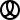

<div align="center">


<h1>Linearly</h1>

<a href="https://baku89.github.io/linearly/">Documentation</a> ⌇ <a href="https://github.com/sponsors/baku89">Become a Sponsor</a>

<p>
  <a href="https://www.npmjs.org/package/linearly">
    
  </a>
  <a href="http://spdx.org/licenses/MIT">
    
  </a>
  
</p>

</div>

A collection of utility functions related to linear algebra and graphics programming.

🍡 I'd appreciate receiving PRs from anyone willing to help with tedious tasks like writing JSDoc, adding necessary functions, or writing tests.

This library is based on [glMatrix](https://github.com/toji/gl-matrix), but adopts an immutable data structure. So you don't need to specify a receiver matrix as the first argument.

### glMatrix

```ts
// In glMatrix, you have to manually pass an output vector by reference to reuse allocated memory space efficiently.
const dir = vec3.fromValues(2, 1, 3)
vec3.normalize(dir, dir)

const out = vec3.create()
vec3.cross(out, dir, [0, 1, 0])
vec2.scale(out, out, 3)
```

### Linearly

```ts
// In linearly, you can simply write like this:
import {mat2d, vec3} from 'linearly'

const dir = vec3.normalize([2, 1, 3])
let out = vec3.cross(dir, [0, 1, 0])
out = vec3.scale(out, 3)

// As the values of Linearly are plain 1D arrays, you can initialize a vector either way.
const a: vec2 = [1, 2]
const b = vec2.of(1, 2)

// But since vectors and matrices are immutable and annotated with readonly flags, a mutation such as below is handled as an error in TypeScript.
a[0] = 3
// ^
// Cannot assign to '0' because it is a read-only property.

// Some constants such as mat2d.ident are also readonly and defined as frozen arrays (via Object.freeze). You can use `clone` to mutate them.
const m = mat2d.clone(mat2d.ident)
m[4] *= 2.0
m[5] = -4.5
```

The library provides functions inspired by the following sources:

- [glMatrix](https://glmatrix.net/) - `add`, `subtract`, `scale`, `normalize`, `dot`, `cross`, `lerp`, `distance`, `transformMat*`
- [GLSL](https://registry.khronos.org/OpenGL-Refpages/gl4/html/indexflat.php) - `step`, `mix`, `smoothstep`, `reflect`, `refract`, `faceforward`
- [Vex in Houdini](https://www.sidefx.com/docs/houdini/vex/functions/) - `fit`, `efit`, `invlerp`, `degrees`, `radians`
- [Unity](https://docs.unity3d.com/Manual/index.html) - `inverseLerp`, `oneMinus`, `saturate`

## Development

```sh
git clone https://github.com/baku89/linearly
cd linearly
yarn install
yarn test --watch
```

## License

This repository is published under an MIT License. See the included [LICENSE file](./LICENSE).
